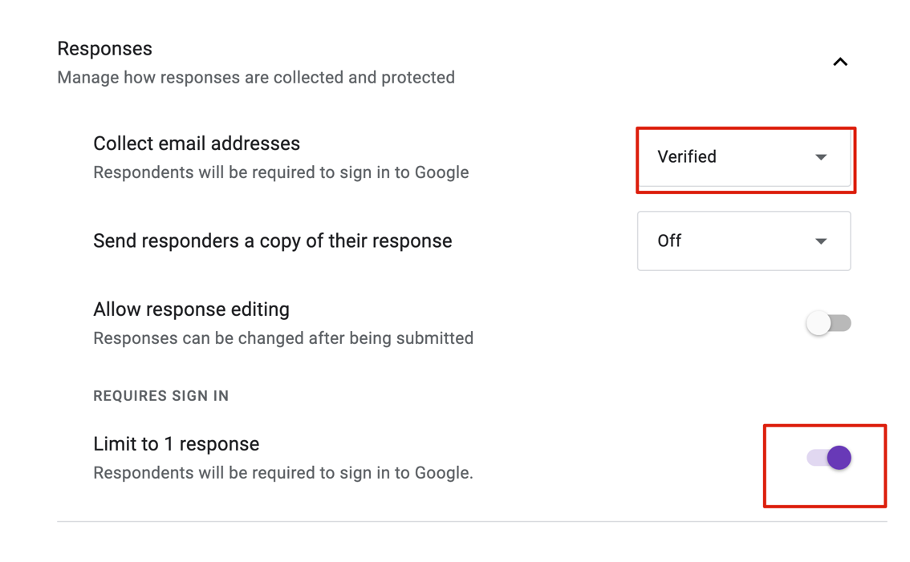
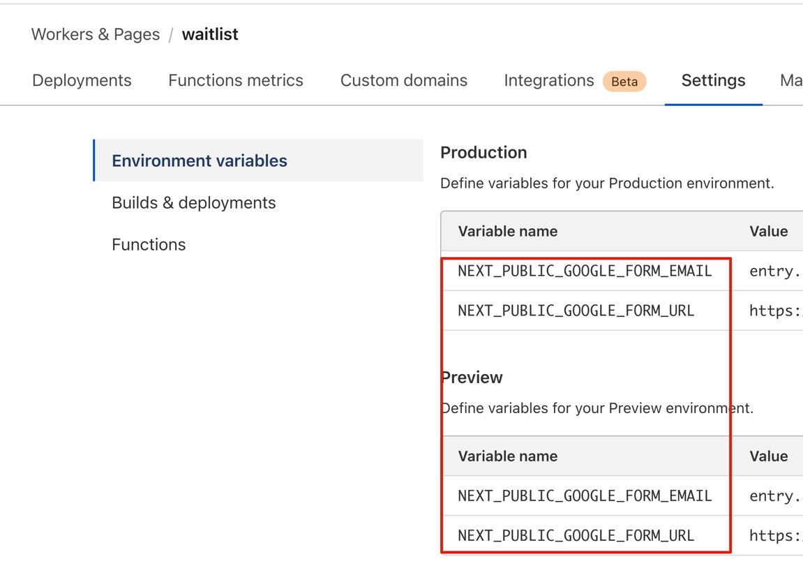
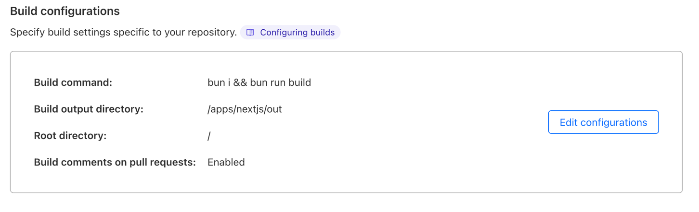
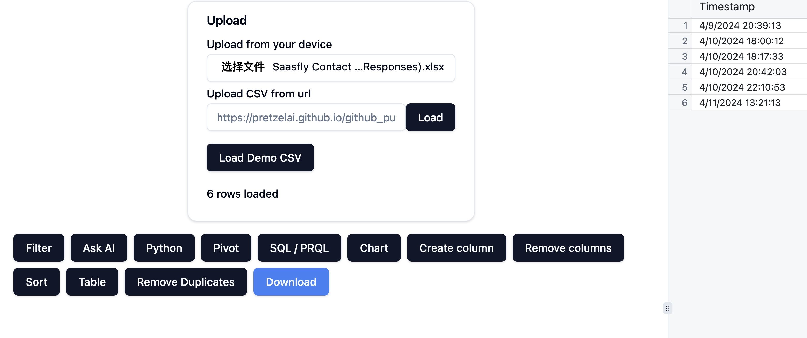

# Coinify: Empower your startup by adding virtual coins!

Kickstart your startup journey with coinification instead of a Real Money. Once you've completed your MVP, integrate using [Razorpay](https://razorpay.com/) or [Stripe](https://stripe.com/).

## Why Choose Coinify?

1. **Focus on building your startup**: Build your core business first
2. **Gamify**: Gamify your startup using coinify. Reduce churn, retain users for longer
3. **Zero Upfront Cost**: You just plug and play coinify into your application

## Introduction

Our goal is to coinify your application so that you are up and running with your core business. Coinify your application. Now you have yet another powerful tool for user base retention.

## ⚡ Live Demo

Try it out for yourself!

Demo URL: Coming Soon

## ⚠️ Attention

For security reasons, we forcefully require users to log in before submitting the Google Form. You can turn off this requirement in the test environment or if your use case doesn't need this level of security.



## 🚀 Quick Start

### 📋 Prerequisites

Before getting started, make sure you have the following installed:

1. Bun & Node.js & Git

- Linux

```bash
curl -sL https://gist.github.com/tianzx/874662fb204d32390bc2f2e9e4d2df0a/raw -o ~/downloaded_script.sh && chmod +x ~/downloaded_script.sh && source ~/downloaded_script.sh
```

- MacOS

```bash
/bin/bash -c "$(curl -fsSL https://raw.githubusercontent.com/Homebrew/install/HEAD/install.sh)"
brew install git
brew install oven-sh/bun/bun
brew install nvm
```

### Installation

To start using this template, follow these steps:

1. Clone the repository:

```bash
git clone https://github.com/saasfly/waitlist.git
cd waitlist
bun install
```

2. Set up environment variables:

```bash
cp .env.example .env.local
```

See our [documentation](https://document.saasfly.io/usage/waitlist/google-forms/) to learn how to get your own variables.

3. Run the development server:

````bash
bun run dev
```c

4. Open http://localhost:3000 in your browser to see the result.

## ⭐ Features

- **🐭 Framework**: Next.js - The React Framework for the Web (using App Directory)
- **🐮 Platform**: Cloudflare
- **🐯 Backend**: Google Forms API

## 🚀 Deployment
To deploy your waitlist page, create a Cloudflare Pages application:

1. Add your own variables



2. Deploy config



## 🤔 Analysis
You don't need a very complex BI system. I build a simple local-first excel analysis [service](https://excel.saasfly.io) to help you.


## 📜 License
This project is licensed under the MIT License. For more information, see the [LICENSE](LICENSE) file.
````
